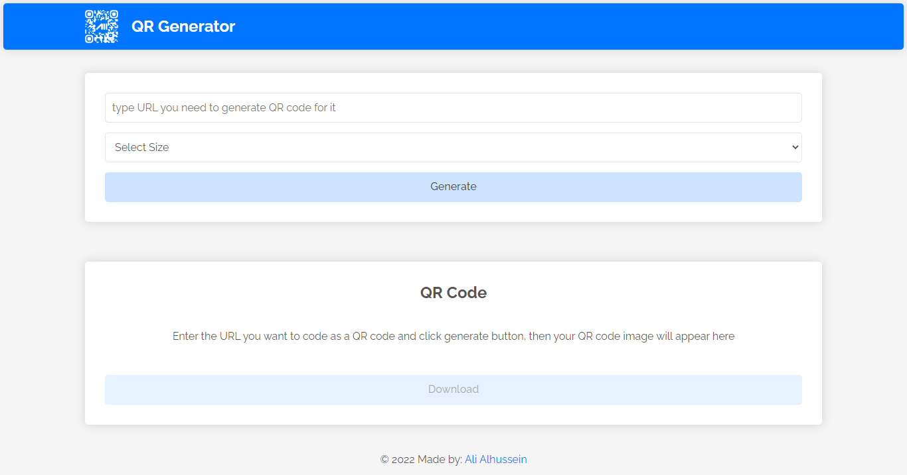
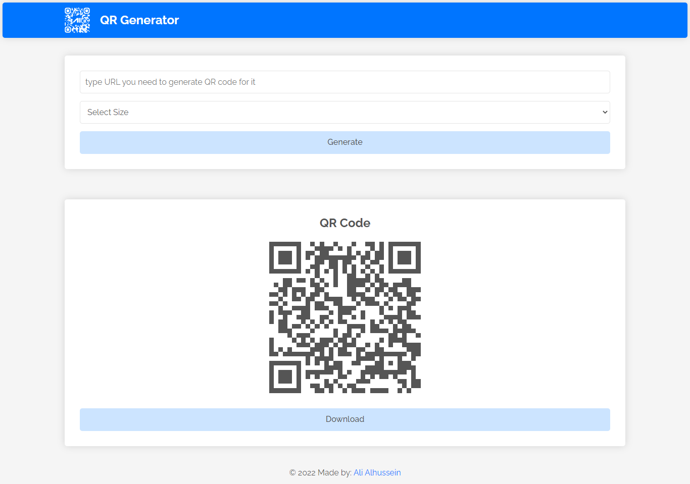
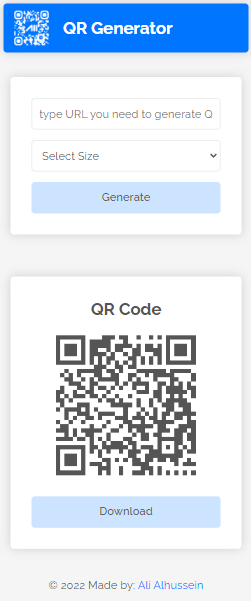

# QR Code Generator
This repository is a QR Code Generator application developed using HTML, CSS, and vanilla JavaScript.

## Live Previwe
[Github Pages](https://alialhussein.ml/qr-app)

## Credits
* Free Google font [Raleway](https://fonts.google.com/specimen/Raleway)
* [qrcodejs](https://github.com/davidshimjs/qrcodejs)

